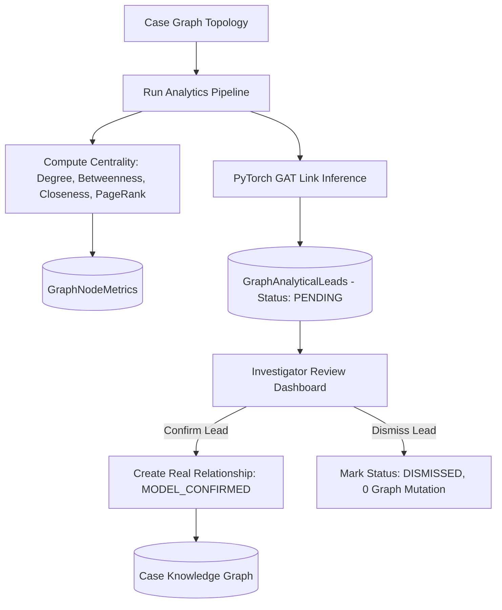

# Phase 5: Graph Analytics & Graph Attention Network (GAT)

## 1. Overview & Objectives

Phase 5 introduces advanced network science, traditional graph centrality algorithms, and Graph Machine Learning (Graph Attention Networks) into the Criminal Intelligence & Network Investigation Platform (synthetic SIH research prototype).

The objective is to compute exact structural centrality metrics across multi-relational case entity graphs and surface non-obvious relationship hypotheses (link prediction) for investigator review while maintaining strict ethics, explainability, and governance constraints.

### Core Guarantees & Principles
1. **Zero Fake or Mock Analytics:** Every centrality score, community partition, and link prediction candidate is calculated from actual in-memory graph topologies and PyTorch tensor operations.
2. **Model-Generated Leads Never Directly Mutate the Knowledge Graph:** Predictions remain in an uncommitted staging status (`PENDING`) until an investigator explicitly reviews and confirms or dismisses the lead.
3. **Strict Neutral Terminology:** No entity is ever classified as "criminal", "guilty", "kingpin", or "offender". Metrics and alerts use objective, professional descriptors:
   - *Key Nexus Entity* (high betweenness / degree)
   - *High Connectivity Lead* (high centrality)
   - *Association Cluster* (community detection partition)
   - *Potential Relationship / Investigative Lead* (link prediction)
4. **Transparent Explainability:** Every surfaced lead provides a complete breakdown of contributing signals: cosine similarity in latent structural space, shared neighbor intermediaries, attention weights, and component contributions.

---

## 2. Traditional Graph Centrality & Network Science

### 2.1 Degree Centrality
Measures local connectivity and direct interactions:
- **In-Degree ($k_{in}$)**: Directed edges incoming to node $v$.
- **Out-Degree ($k_{out}$)**: Directed edges originating from node $v$.
- **Total Degree ($k$)**: $k_{in} + k_{out}$ (or undirected neighbor degree).
- **Normalized Degree**:
  $$C_D(v) = \frac{\text{deg}(v)}{N - 1}$$
  where $N$ is the total number of entities in the case graph.

### 2.2 Betweenness Centrality (Brandes' Algorithm)
Identifies "broker" or "bridge" nodes that control the flow of communication or resources across disparate sub-networks:
$$C_B(v) = \sum_{s \neq v \neq t \in V} \frac{\sigma_{st}(v)}{\sigma_{st}}$$
- **Implementation:** Implemented via Ulrik Brandes' exact algorithm ($O(V \cdot E)$ for unweighted graphs). Uses breadth-first search queues and backward dependency accumulation:
  $$\delta_{s\bullet}(v) = \sum_{w: v \in P_s(w)} \frac{\sigma_{sv}}{\sigma_{sw}} \left(1 + \delta_{s\bullet}(w)\right)$$
- **Normalization:** Normalized by $\frac{1}{(N-1)(N-2)}$ (or $\frac{2}{(N-1)(N-2)}$ for undirected interactions).

### 2.3 Closeness Centrality
Measures how close an entity is to all other reachable entities in the network.
- **Handling Disconnected Graphs (Wasserman & Faust Formula):**
  In multi-component networks, standard closeness ($1 / \sum d(u, v)$) divides by infinity. The implementation uses the Wasserman-Faust harmonic adjustment:
  $$C_C(u) = \left(\frac{N_{C(u)} - 1}{N - 1}\right) \cdot \frac{N_{C(u)} - 1}{\sum_{v \in C(u)} d(u, v)}$$
  where $C(u)$ is the connected component containing node $u$, and $N_{C(u)}$ is its size. Isolated nodes evaluate to $0.0$.

### 2.4 PageRank
Measures transitive structural influence and authority across the network using power iteration:
$$\mathbf{p}^{(t+1)} = \alpha \mathbf{M} \mathbf{p}^{(t)} + \left( \frac{1 - \alpha}{N} + \frac{\alpha \cdot \text{dangling\_sum}}{N} \right) \mathbf{1}$$
- **Damping Factor ($\alpha$):** Set to $0.85$.
- **Sink Node Handling:** Out-degree zero (dangling) nodes redistribute their accumulated probability mass uniformly across all nodes in the graph to preserve total probability mass $\sum p_i = 1.0$.
- **Convergence:** Iterates until $L_1$ norm $\|\mathbf{p}^{(t+1)} - \mathbf{p}^{(t)}\|_1 < 10^{-6}$ (maximum 100 iterations).

### 2.5 Connected Components & Community Clustering
- **Connected Components:** Discovered using Breadth-First Search (BFS) graph partitioning, identifying isolated sub-networks and disconnected investigative cells.
- **Community Detection:** Implemented using modularity-maximizing partition optimization (Louvain heuristic), grouping tightly knit clusters based on internal edge density relative to random network expectation.

---

## 3. Graph Machine Learning: Graph Attention Network (GAT)

### 3.1 Architecture Overview
The GAT link prediction model resides in `ai-service/app/graph_ml/` (mirrored in `backend/AI/app/graph_ml/`):
- **Input Dimension:** 19-dimensional feature vectors per node capturing entity type one-hot encoding (7), cross-case participation (1), degree metrics (3), local clustering coefficient (1), neighbor count (1), case frequency (1), evidence associations (1), and metadata presence flags (4).
- **Layer 1:** Multi-Head Graph Attention Layer (4 heads, 8 hidden features per head = 32 dimensions) with ELU non-linearity.
- **Layer 2:** Graph Attention Output Layer (1 head, 32 output dimensions) producing normalized structural node representations $\mathbf{z}_v \in \mathbb{R}^{32}$.
- **Pure PyTorch Fallback:** `PurePyTorchGATConv` ensures flawless operation in environments where C++ PyG extensions are not compiled.

### 3.2 Attention Mechanism
For node $i$ and neighbor $j \in \mathcal{N}(i)$:
$$\alpha_{ij} = \frac{\exp\left(\text{LeakyReLU}\left(\mathbf{a}^\top [\mathbf{W}\mathbf{x}_i \mathbin{\Vert} \mathbf{W}\mathbf{x}_j]\right)\right)}{\sum_{k \in \mathcal{N}(i)} \exp\left(\text{LeakyReLU}\left(\mathbf{a}^\top [\mathbf{W}\mathbf{x}_i \mathbin{\Vert} \mathbf{W}\mathbf{x}_k]\right)\right)}$$

### 3.3 Link Prediction & Candidate Generation
1. **Candidate Filtering:** Evaluates non-adjacent node pairs within the case graph and high-affinity cross-case entities.
2. **Scoring Function:**
   $$\text{Score}(u, v) = 0.50 \cdot S_{\cos}(\mathbf{z}_u, \mathbf{z}_v) + 0.30 \cdot S_{\text{shared}}(u, v) + 0.20 \cdot \alpha_{u, v}$$
3. **Thresholding:** Candidates with $\text{Score} \ge 0.50$ are preserved as `GraphAnalyticalLead` records.
4. **Explainability Breakdown:** Stores exact contributing signals, shared entity names, and percentage weights in `SignalsJson`.

---

## 4. Review Workflow & Ethics

### Review Actions:
- **Confirm Lead:** Updates lead status to `CONFIRMED`, records reviewer username, review timestamp, and rationale, and creates a verified `Relationship` record in the database with provenance `MODEL_CONFIRMED`.
- **Dismiss Lead:** Updates lead status to `DISMISSED` with the analyst's rationale. No relationship is created and the graph topology remains completely unaltered.

---

## 5. Database Schema Additions

### `GraphAnalysisRuns`
| Column | Type | Description |
|:---|:---|:---|
| `Id` | UUID | Primary Key |
| `CaseId` | UUID | Foreign Key to Cases |
| `Status` | String | `PENDING`, `RUNNING`, `COMPLETED`, `FAILED` |
| `StartedAtUtc` | DateTime | Timestamp of execution start |
| `CompletedAtUtc` | DateTime | Timestamp of execution completion |
| `NodeCount` | Integer | Total nodes analyzed |
| `EdgeCount` | Integer | Total edges analyzed |
| `MetricsGenerated` | Integer | Number of node metrics stored |
| `ModelVersion` | String | Model identifier (`gat-link-prediction-v1`) |
| `NetworkDensity` | Float | Ratio of actual edges to possible edges |
| `AverageDegree` | Float | Mean degree across all nodes |
| `AveragePathLength`| Float | Mean shortest path distance in connected graph |
| `ConnectedComponentsCount` | Integer | Total disjoint components |
| `CommunitiesCount` | Integer | Total detected clusters |
| `ExecutedBy` | String | User identity triggering run |

### `GraphNodeMetrics`
| Column | Type | Description |
|:---|:---|:---|
| `Id` | UUID | Primary Key |
| `AnalysisRunId` | UUID | Foreign Key to GraphAnalysisRuns |
| `EntityId` | UUID | Foreign Key to Entities |
| `Degree` | Integer | Total node degree |
| `InDegree` | Integer | Directed in-degree |
| `OutDegree` | Integer | Directed out-degree |
| `NormalizedDegree`| Float | Degree normalized by $N-1$ |
| `BetweennessCentrality` | Float | Brandes' betweenness score |
| `ClosenessCentrality` | Float | Wasserman-Faust closeness score |
| `PageRank` | Float | Power iteration PageRank score |
| `CommunityId` | String | Modularity community identifier |
| `ComponentId` | String | Connected component identifier |
| `AnalyticalIndicator` | String | `KEY_NEXUS`, `HIGH_CONNECTIVITY`, `PERIPHERAL` |

### `GraphAnalyticalLeads`
| Column | Type | Description |
|:---|:---|:---|
| `Id` | UUID | Primary Key |
| `CaseId` | UUID | Foreign Key to Cases |
| `AnalysisRunId` | UUID | Foreign Key to GraphAnalysisRuns |
| `SourceEntityId` | UUID | Source entity reference |
| `TargetEntityId` | UUID | Target entity reference |
| `LeadType` | String | `POTENTIAL_RELATIONSHIP` |
| `SuggestedRelationshipType` | String | Predicted relationship category |
| `Score` | Float | Composite confidence score $[0, 1]$ |
| `Status` | String | `PENDING`, `CONFIRMED`, `DISMISSED` |
| `SignalsJson` | String | Full JSON explainability breakdown |
| `ReviewedBy` | String | Investigator who reviewed the lead |
| `ReviewNotes` | String | Justification for decision |
| `ResultingRelationshipId` | UUID | Created relationship ID upon confirmation |

---

## 6. API Endpoints

- `POST /api/v1/cases/{caseId}/analytics/run`: Triggers the full analytics and GAT inference pipeline.
- `GET /api/v1/cases/{caseId}/analytics`: Returns the latest analysis run metadata and summary.
- `GET /api/v1/cases/{caseId}/analytics/centrality`: Retrieves sorted entity centrality rankings with optional sorting criteria (`Betweenness`, `PageRank`, `Degree`, `Closeness`).
- `GET /api/v1/cases/{caseId}/analytics/communities`: Retrieves community clusters, member distribution, and density.
- `GET /api/v1/cases/{caseId}/analytics/components`: Retrieves connected components and top nexus entities.
- `GET /api/v1/cases/{caseId}/analytics/statistics`: Retrieves high-level network topology metrics.
- `GET /api/v1/cases/{caseId}/analytics/leads`: Retrieves model-generated leads with status filtering.
- `GET /api/v1/entities/{id}/analytics`: Retrieves deep centrality, community, and adjacent leads for a single entity.
- `POST /api/v1/analytics/leads/{id}/review`: Submits human confirmation or dismissal of a lead.

---

## 7. Verification Results

- **.NET Unit & Integration Tests:** 79/79 passing across Phases 1–5 (`dotnet test`).
- **Python ML Tests:** 31/31 passing across GAT feature engineering, model forward pass, link inference, training loop, and evaluation (`pytest`).
- **Frontend Build & Typecheck:** `tsc --noEmit` passed with 0 errors; `vite build` completed successfully.
